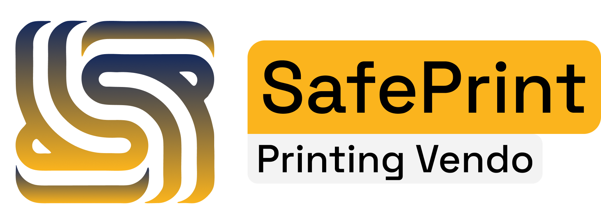
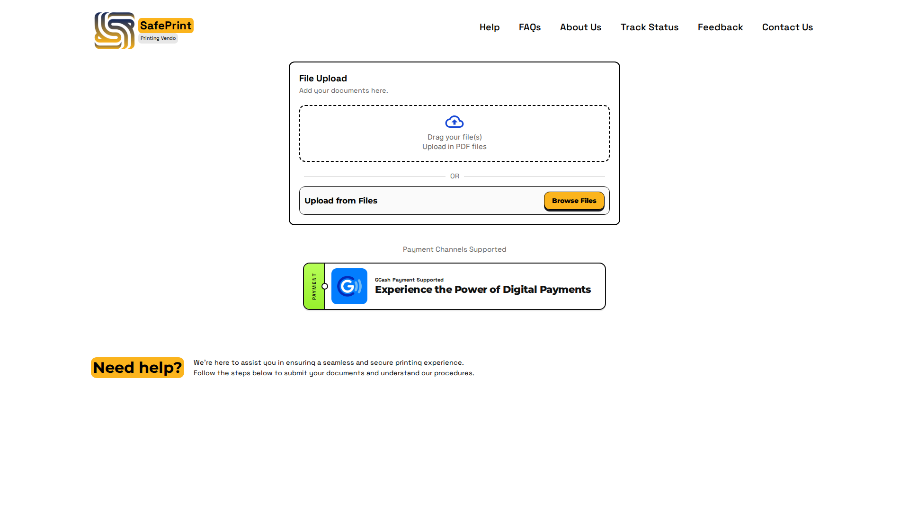

  

  <a href="deployment_guide.md">📦 Deployment Guide</a>

  

---

## Summary

SafePrint is a privacy-focused printing vendo system that enables secure and automated document handling to improve both data privacy and operational efficiency. It addresses the security and efficiency limitations of traditional printing shops, where customers often send files through unsecured messaging apps—exposing sensitive information to unauthorized access and prolonged data retention. Conventional printing practices also rely on manual coordination between customers and service providers, which results in delays in print requests.

Developed as a capstone research project at Batangas State University, The National Engineering University (College of Informatics and Computing Sciences, Alangilan Campus), SafePrint presents a self-service printing solution that improves privacy, efficiency, and reliability in printing services.

**Researchers:** Crystaline M. Datu, Lovely C. Guerra, Jay E. Hosmillo, Vincent P. Perez  
**Funding:** Young LIFTers Program (YLP) Season 3

---

## The Problem

Students and customers at educational institutions commonly visit nearby printing service providers to print school IDs, registration forms, academic papers, and other documents. This practice creates significant privacy risks:

- **Insecure file sharing** — Documents are often sent via email or messaging apps with no guarantee they are deleted after printing.
- **Prolonged data retention** — Files that were assumed to be removed may still exist on shop computers or in chat histories.
- **Manual coordination** — Back-and-forth between customers and shop staff causes delays and operational inefficiency.
- **Growing threat landscape** — In the Philippines, data breaches continue to rise, and unencrypted file transfers without proper access controls leave users vulnerable to identity theft, financial loss, and reputational damage.

Traditional printing workflows lack the security controls needed to ensure document integrity, appropriate storage, and timely deletion.

---

## Our Solution

SafePrint replaces insecure file-sharing methods with a **LAN-based, self-service printing vendo** that customers access over a dedicated Wi-Fi network. The system automates the full print workflow—from secure document submission through payment verification, print routing, and physical document pickup—while minimizing human handling of sensitive files.

### How SafePrint Works

1. **Connect** — Customers join the SafePrint Wi-Fi network and open the web portal.
2. **Upload** — PDF documents are submitted over HTTPS, encrypted with ChaCha20, and authenticated with digital signatures.
3. **Pay** — GCash payment is verified automatically through the notification capture app.
4. **Print** — SNMP-based printer monitoring and a Weighted Round Robin (WRR) algorithm route jobs to the best available printer.
5. **Retrieve** — Customers collect printed documents from labeled output trays on the physical vendo unit.
6. **Delete** — Uploaded files are automatically removed after the customer confirms document retrieval, minimizing data exposure and storage usage.

### Security & Privacy

| Mechanism | Purpose |
|-----------|---------|
| **HTTPS (TLS)** | Encrypts data in transit between client and server |
| **ChaCha20 encryption** | Fast, secure document encryption at rest |
| **Digital signatures** | Verifies document authenticity and sender identity |
| **Automatic file deletion** | Removes uploaded files after customer confirmation of pickup |
| **Network segmentation** | Separates client and infrastructure networks for controlled access |
| **Admin isolation** | Administrators cannot view or edit uploaded document contents |

### Print Management

- **SNMP-based polling** — Real-time monitoring of printer status (Ready, Printing, Offline, Sleep)
- **Weighted Round Robin (WRR)** — Routes jobs based on printer availability, paper size match, ink level, and tray capacity
- **Physical vendo enclosure** — Houses five networked printers, a central server, router, and labeled output trays for self-service pickup

---

## What's in This Repository

This repository contains the **SafePrint web application and backend services**—the software layer of the printing vendo system:

- **Django web portal** — Customer-facing upload, payment, confirmation, and status tracking
- **Document processing** — PDF validation, ChaCha20 encryption, digital signatures, and cost estimation
- **Print job management** — Queue management, WRR-based printer routing, and SNMP printer monitoring
- **Payment integration** — GCash payment verification via the SafePrint notification capture app (Flutter + Cloud Firestore)
- **Admin portal** — System management, refund handling, and operational controls
- **Captive portal** — Wi-Fi network access for the LAN-based customer experience
- **Docker & deployment configs** — Containerized setup, Nginx, and Gunicorn service files

### Technology Stack

- **Backend:** Python, Django, MariaDB/MySQL, Apache/Gunicorn, Nginx
- **Frontend:** HTML, CSS, JavaScript
- **Security:** PyCryptodome (ChaCha20 + digital signatures), Let's Encrypt SSL, DuckDNS
- **Monitoring:** SNMP tools for printer status
- **Mobile:** Flutter (GCash notification capture app for Android)
- **Infrastructure:** Ubuntu Server 22.04 LTS, MikroTik router, TP-Link access point, Brother DCP-T430W printers

### Scope & Limitations

- Operates on a **LAN only** — not accessible for remote printing
- Accepts **PDF files only** — jobs cannot be modified after upload
- Supports **standard paper sizes** (short, folio, A4) — no back-to-back printing
- **GCash** is the sole payment method (due to business and compliance requirements)
- Admin mobile app is available on **Android devices only**
- Requires stable **network connectivity** — interruptions may disrupt printing
- Hardware failures still require **manual intervention** (errors are reported via email notifications)

---

## Features

- Secure PDF document upload with encryption and digital signatures
- Automated GCash payment verification
- SNMP-based printer status monitoring
- Weighted Round Robin print job routing
- Real-time print job tracking (Customer ID and voucher codes)
- Automatic file deletion after document pickup confirmation
- Admin dashboard for system management and refund handling
- Email notifications for printer errors and support tickets
- Voucher/credit system for prepaid printing

---

## Getting Started

See the [Deployment Guide](deployment_guide.md) for installation, database setup, local development, and production deployment instructions.

## Contributing

Contributions are welcome! Please open an issue or submit a pull request for any improvements or features.

## Contact

- **Email:** safeprint2025@gmail.com
- **Location:** Golden Country Homes, Brgy. Alangilan, Batangas City, Philippines, 4200
