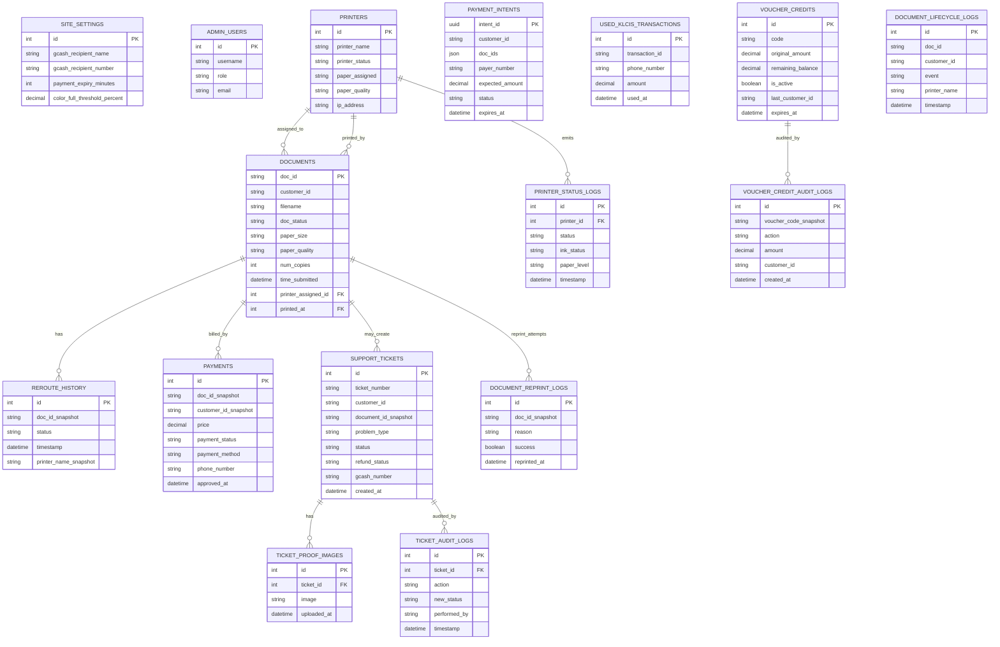
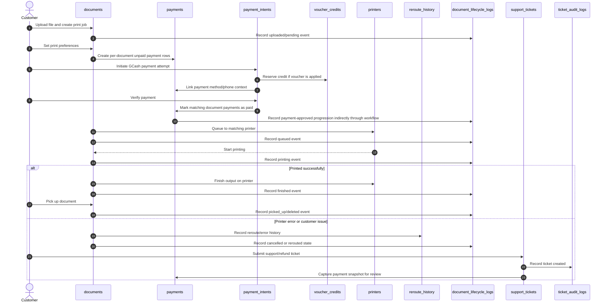

# SafePrint Core Database Schema

This document describes the core SafePrint tables only.

Excluded on purpose:
- Django framework tables such as migrations, sessions, content types, admin logs, and auth-related internals.
- Peripheral custom tables that are not central to the print-payment-support workflow, such as `notification_sounds` and `feedback`.

## Core domains

### 1. System configuration

#### `site_settings`
Single-row configuration table for global system behavior.

Explanation:
- This table is the central control panel for how the vendo behaves.
- When the system needs to know how much to charge, how long payment stays valid, or what GCash details to show, it reads from here.
- In practice, changing this table changes live business rules without changing application code.

Main responsibilities:
- GCash recipient name, number, and QR image.
- Payment expiry and printer-availability gating.
- Pricing rules by size, color, and GSM.
- Support verification windows and auto-ticket timeout behavior.

Notes:
- This acts like an application settings singleton.
- Most runtime pricing and payment behavior depends on this table.

### 2. Printing operations

#### `printers`
Master table for physical printer capability and live scheduler state.

Explanation:
- Each row represents one actual printer that SafePrint can route jobs to.
- The scheduler uses this table to decide whether a printer is available, what paper it supports, and whether it should receive the next document.
- It is both an inventory table and a live operational status table.

Main responsibilities:
- Printer identity: `printer_name`, `model_name`, `ip_address`, `node_name`.
- Capability matching: `paper_assigned`, `paper_quality`.
- Runtime health: `printer_status`, `ink_status`, `tray_level`, `tray_current_count`.
- Scheduling signals: `is_temporarily_disabled`, `scheduling_weight`, `last_assigned_at`, `active_job_count`.

Primary key:
- `id`

#### `documents`
Primary business record for each uploaded print job.

Explanation:
- This is the main table of the whole workflow.
- A row is created when a customer uploads a file, and that row follows the job through pricing, queueing, printing, pickup, cancellation, or deletion.
- If you want to know the current state of a customer print job, this is the first table to inspect.

Main responsibilities:
- Customer/job identity: `doc_id`, `customer_id`, `filename`.
- Print specification: copies, page range, orientation, color mode, paper size, paper quality.
- File storage reference: `stored_name`, `file_type`, `file_size`.
- Lifecycle state: `doc_status`, `queue_priority`, `queued_at`, `status_updated_at`, `time_submitted`.
- Printer routing: `printer_assigned`, `printed_at`.
- Progress tracking: `pages_printed`, `page_copy_counts`.

Primary key:
- `doc_id`

Key relationships:
- Many documents can be assigned to one printer through `printer_assigned`.
- Many documents can have one final output printer through `printed_at`.

#### `reroute_history`
Event table for routing and rerouting history tied to a document.

Explanation:
- This table answers the question: why did a document move from one printer path to another?
- It keeps a historical record of failed assignments, manual reroutes, and printer-related recovery actions.
- That makes it useful for diagnosing printer instability and understanding how a job reached its final printer.

Main responsibilities:
- Preserve printer/document snapshots during reroutes and failures.
- Track transitions such as assignment errors, reroutes, and printing path changes.

Primary keys and links:
- FK to `documents`
- FK to `printers`

#### `document_reprint_logs`
Tracks reprint attempts after failures or customer-reported issues.

Explanation:
- This table exists for cases where the original print was not the end of the story.
- It records when staff or workflow logic had to print a document again, why that happened, and whether the reprint succeeded.
- It is important for operational review, refund checks, and repeat-error tracking.

Main responsibilities:
- Reason for reprint.
- Requested pages or page ranges.
- Printer used for the reprint.
- Success/failure outcome.

Primary keys and links:
- FK to `documents`
- Optional FK to `printers`

#### `printer_status_logs`
Historical printer telemetry and state changes.

Explanation:
- This is the time-based history behind the current printer status.
- Instead of only knowing the latest state of a printer, SafePrint can look back and see when paper, ink, or printer-health conditions changed.
- That history is useful when verifying complaints such as faded prints, empty trays, or printer downtime.

Main responsibilities:
- Timestamped printer status history.
- Ink and paper-level evidence for ticket verification and operational audits.

Primary keys and links:
- FK to `printers`

#### `document_lifecycle_logs`
Permanent lifecycle audit for documents, even after document deletion.

Explanation:
- This table preserves the story of a document after the live `documents` row may already be gone.
- It is designed as long-lived evidence for support, auditing, and refund review.
- If a customer disputes what happened to a file, this table is often the safest historical source.

Main responsibilities:
- Records immutable events like uploaded, queued, printing, finished, cancelled, picked up, deleted, reprinted.
- Preserves evidence after the live `documents` row is gone.

Why it matters:
- Refund and dispute verification should rely on this table when the original document row no longer exists.

### 3. Payment and credit operations

#### `payments`
Per-document payment record.

Explanation:
- Each row represents the billing state of one document, not just one customer session.
- This lets SafePrint keep an accurate record of what was owed and paid for every print job, even when several jobs were paid together.
- Because the row keeps snapshots, it still remains useful after the original document is removed from the live queue.

Main responsibilities:
- Store price and payment status for each document.
- Preserve document snapshots so payment evidence survives document deletion.
- Store payment metadata such as payment method, phone number, verifier, approval time, and legacy KLCiS/Xendit references.

Primary keys and links:
- Optional FK to `documents`

Important design detail:
- Payment rows are intentionally snapshot-heavy so they remain useful even after the document is picked up and deleted.

#### `payment_intents`
Short-lived payment attempt table for SafePrint-managed GCash listener flow.

Explanation:
- This table represents an in-progress payment attempt rather than a final accounting record.
- It exists while the customer is on the payment page and SafePrint is waiting to verify whether the expected payment arrived.
- Once the flow is resolved, this table is mainly control-state, while `payments` remains the lasting business record.

Main responsibilities:
- Groups one customer payment attempt across one or more documents.
- Stores expected amount, payer number, expiry, recipient info, matched notification reference, and verification status.
- Serves as the active control record for `initiate`, `verify`, and `cancel` actions on the payment page.

Primary key:
- `intent_id` (UUID)

Important design detail:
- `payments` is the durable per-document ledger.
- `payment_intents` is the temporary orchestration state for one live payment attempt.

#### `used_klcis_transactions`
Deduplication table for previously matched KLCiS transaction IDs.

Explanation:
- This is a protection table.
- Its role is to remember that a transaction reference was already consumed, so the same external payment signal cannot be reused for another job.
- Even though it is small, it is important for payment-integrity and fraud-prevention logic.

Main responsibilities:
- Prevent old KLCiS transaction IDs from being reused against newer print jobs.

Use case:
- Legacy payment matching safety.

#### `voucher_credits`
Stores reusable customer credit vouchers.

Explanation:
- This table holds customer value that can be reused later instead of being immediately discarded.
- It supports cases like excess payment, refunds converted to credit, or partial balances kept for future use.
- In practice, it behaves like a stored-value balance system inside SafePrint.

Main responsibilities:
- Track original credit amount, remaining balance, active state, expiry, and last customer that touched the code.
- Support excess-credit and recovery-credit workflows.

Primary key:
- unique voucher `code`

#### `voucher_credit_audit_logs`
Immutable audit log for voucher creation, reservation, redemption, restoration, expiration, and deletion.

Explanation:
- This table explains how a voucher changed over time.
- Instead of only seeing the current balance, staff can trace every meaningful action that affected that voucher.
- That makes it essential for reconciling disputes or debugging unexpected credit changes.

Main responsibilities:
- Explain how voucher balances changed over time.
- Provide traceability for auto-refund and minimum-charge credit flows.

Primary keys and links:
- Optional FK to `voucher_credits`

### 4. Support and refund operations

#### `support_tickets`
Main customer support table for print errors, payment issues, refunds, and manual review.

Explanation:
- This is the operational case file for customer issues.
- When something goes wrong and the normal automated flow is no longer enough, SafePrint opens or records the issue here for human follow-up.
- It combines customer details, issue classification, evidence context, and resolution state in one place.

Main responsibilities:
- Customer contact data.
- Ticket classification and description.
- Reprint context.
- Receipt code/screenshot and GCash refund details.
- Resolution status, resolver identity, notes, and privacy-retention fields.
- Snapshot fields for payment evidence at the time of investigation.

Primary key:
- unique `ticket_number`

Key relationships:
- Optional FK to `documents`
- One ticket can reference multiple related documents through `related_doc_ids`.

#### `ticket_proof_images`
Stores uploaded proof photos for a support ticket.

Explanation:
- This table keeps the visual evidence attached to a ticket.
- A ticket can have several proof images, so they are stored separately instead of crowding the main ticket row.
- This separation keeps the ticket table cleaner while still preserving investigation evidence.

Main responsibilities:
- Attach one or more evidence images to a ticket.

Primary keys and links:
- FK to `support_tickets`

#### `ticket_audit_logs`
Audit trail for all support-ticket actions.

Explanation:
- This table records what happened to a ticket after it was created.
- It provides accountability by showing who changed the status, added review actions, processed refunds, or performed cleanup.
- For investigations, this is the timeline of staff handling.

Main responsibilities:
- Track creation, status changes, refund actions, verification, notes, voiding, and data purge events.

Primary keys and links:
- FK to `support_tickets`

### 5. Admin operations

#### `admin_users`
Application-specific admin account table.

Explanation:
- This table stores the accounts used in the SafePrint admin experience itself.
- It exists so the application can keep its own admin identity and profile data separate from Django’s internal framework tables.
- When reviewing dashboard access or admin ownership inside the app domain, this is the relevant table.

Main responsibilities:
- Stores admin login/profile data used by the custom admin dashboard.

Note:
- This is separate from Django’s built-in admin/auth tables.

## Relationship summary

- `site_settings` controls pricing and payment behavior globally.
- `printers` represents the available output devices.
- `documents` is the center of the operational workflow.
- `payments` holds durable per-document payment state.
- `payment_intents` holds temporary multi-document payment attempt state.
- `support_tickets` handles manual intervention and refund workflows.
- Audit/event tables preserve evidence after live operational rows are changed or removed.

## Mermaid ER Diagram

## Mermaid Sequence Diagram

This sequence shows the main SafePrint flow from upload to payment, printing, and support escalation.

## Practical reading order

If you are tracing a production issue, start here:

1. `documents`
2. `payments`
3. `payment_intents`
4. `document_lifecycle_logs`
5. `reroute_history`
6. `support_tickets`
7. `ticket_audit_logs`
8. `voucher_credits` and `voucher_credit_audit_logs` when credits or refunds are involved

## Short version

The center of the schema is:
- `documents` for the live print job
- `payments` for durable per-document billing
- `payment_intents` for active GCash verification attempts
- `printers` for routing and output
- `support_tickets` for manual intervention
- audit/event tables for evidence that survives deletion of live rows
